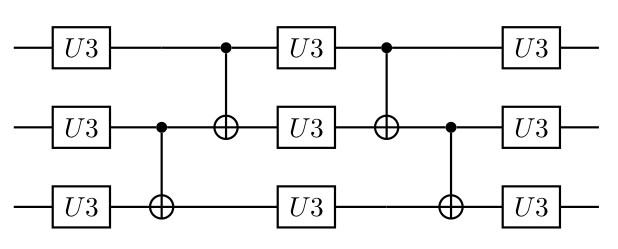
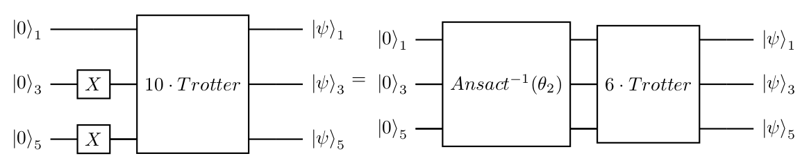

# 1 Novel algorithm to Simulation on NISQ device

```julia
using QuantumCircuits
using QuantumCircuits.QML
using QuantumCircuits.QCircuits.Qiskit
using QuantumCircuits.QCircuits.Qiskit: qiskit
using QuantumCircuits.QCircuits.Circuit
using QuantumCircuits.QCircuits.Circuit: toQiskit, getCode
using QuantumCircuits.QCircuits.Gates: CX
using QuantumCircuits.Execute: generate_mesuere_circuits, extractProbability, correctMeasures
```

# 2 Introduction

Our goal is to implement the Trotterization to evolve the specified state $$|110\rangle$$, under the specified Hamiltonian, for the specified duration $$\pi$$ but utilize as many Trotter steps as is possible. The algorithm, in principle, should be executed for any state, Hamiltonian, and duration.

Unfortunately on the current quantum computer, this is impossible regarding the noises. Therefore I've proposed an algorithm that can break the Trotterization into pieces with a shorter depth which can be executed on current quantum computers. The main points and requirements of the algorithm:
- It breaks the Trotterization into pieces with a shorter depth.
- It is convergent to the final state.
- The designed algorithm should allow us to find the simulated state for an arbitrary number of qubits.

The first stage is to find a way how to effectively implement a trotter step, the details of that can be found in  [Cartan's KAK decomposition](@ref). 

# 3 The overview of algorithm

Let's assume, that we would like to implement an algorithm with 10 Trotter steps, but using at most 2 Trotter steps in single circuit execution. We can do this by implementing the circuit below and using the gradient descent method to find the parameters $\theta_1$ that minimize our cost function. The cost function is chosen that after finding the optimal parameters the output status is $|0\rangle_3$.
Why I use $|000\rangle$ as a target state, there are a few reasons:
1. We need to avoid any superposition and use only base state $|000\rangle$, $|001\rangle$, eg. Using superposition implies variance > 0 during expectation measurement even on the perfect device, for the base state the variance is equal to 0. This is important because any fluctuation impact derivative calculation using the shift-parameter rule.
1. The $|000\rangle$ state in natural choice because this is the starting point for quantum device.

First, we would like to fit the expected distribution. The use of entropy loos is a natural choice point. In our case, the expected distribution has only one non zero value for state 000, so the entropy loss looks like: $-\ln{P(|000\rangle)}$ But the other requirement is that the error for the other state should be equally distributed, so we prefer $\frac{|001\rangle + |010\rangle}{\sqrt{2}}$ to $|001\rangle$ but the entropy for both of the states is equal. Therefore our loss function is equal to: $-\ln{P(|000\rangle)} + \sum_{i = |001\rangle}^{|111\rangle}P(i)^2$ (see [Algorithm evaluation](https://github.com/rafal-pracht/OpenScience21.jl/blob/main/04_algorithm_evaluation.ipynb))


If the optimal parameters were found, the operator inverse of _**Ansatz**_ transform the initial state into the state after the initialization and the two trotter steps. 

Is worth noting that: if any circuit _T_ transforms the initial state $|000\rangle$ into some state $\psi$,  and we find any other _A_ circuit that transforms state $\psi$ into the $|000\rangle$ one we know that the inverse of the _A_ circuit creates the state $\psi$ from state $|000\rangle$ with accuracy to global phase (which is irrelevant and can be omitted). Note, that circuits _A_ and _T_ are not equivalent (so they unitary may not and usually are not equal), but this is ok for us we only would like to transform the given input state to the given output. And because these unitaries don't have to be equal, it is easy to prepare Ansatz and find the best parameters.

So the circuits on figure below are equivalent.


In the Figure below, you can find the Ansatz with 27 parameters used in the algorithm implementation.



It is worth noting:
* We are not looking for parameters that implement the whole unitary matrix of the 2 Trotter steps with the greatest accuracy, but only a transformation for a specific input state. This implies that it is relatively easy to find these parameters. 
* Using the Ansatz, we can replace the circuit with 15 CNOT gates with the one with only 4 CNOT gates.
* I use exactly the same Ansatz for all iterations but when can have different Ansatzs for other iterations.

## 3.1 Next step
Then we do a similar step and try to find the parameters $\theta_2$ using the gradient descent method that make the circuit in the Figure below will finish at state $|0\rangle_3$.


If the optimal parameters $\theta_2$ were found, the operator inverse of _**Ansatz**_ transform the initial state into the state after the initialization and the 4 trotter steps. So the circuits on Figure below are equivalent.



By continuing this algorithm finally, we can find the parameters which implement the whole Trotterization, see Figure below.


## 3.2 Result evaluation
I've evaluated the algorithm on the simulator with time set to $\frac{\pi}{4}$, $\frac{\pi}{2}$, $\frac{3\pi}{4}$, $\pi$ and it works fine. So this show that it will work not only for the special case where the whole circuit is identity. The evaluation can be found in the notebook [Algorithm evaluation](https://github.com/rafal-pracht/OpenScience21.jl/blob/main/04_algorithm_evaluation.ipynb)

## 3.3 Trening
I've also find the parameters $\theta_1$ of the first step on quantum computer (ibm jakarta).The parameter for steps from 2 to 5 ($\theta_2, \theta_3, \theta_4, \theta_5$) was found on the noisy quantum simulator (as was discussed with AJ). Description of the process of finding the parameter is described in a notebook [QML Trening](https://github.com/rafal-pracht/OpenScience21.jl/blob/main/05_trening.ipynb).


# 4 Execute on the real device
The whole solution using QuantumCircuits library is available in [GitHub](https://github.com/rafal-pracht/OpenScience21.jl).