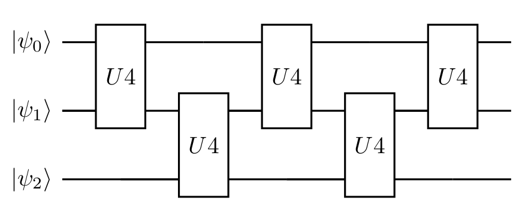

# 1 Cartan's KAK decomposition
We want to implement the trotter step in an effective way, but a naive implementation of ZZ, XX, and YY gates requires 6 CX gates. We will show how to do the same using only the 3CX gate by Cartan's KAK decomposition.

# 2 ZZ, XX, and YY gates
Now we have to create ZZ, XX, and YY gates for use in simulation.

```julia
using QuantumCircuits
using QuantumCircuits.QML
using QuantumCircuits.QCircuits.Qiskit
using QuantumCircuits.QCircuits.Qiskit: qiskit
using QuantumCircuits.QCircuits.Circuit
using QuantumCircuits.QCircuits.Circuit: toQiskit, getCode
using QuantumCircuits.QCircuits.Gates: CX
using QuantumCircuits.Execute: generate_mesuere_circuits, extractProbability, correctMeasures
```

```julia
# This code com from using QuantumCircuits.Simulation.Gates module.
function ZZ(qc, q0, q1, t, usePulse=false)
    if usePulse
        qc.h(q1)
        qc.rzx(q0, q1, t)
        qc.x(q0)
        qc.rzx(q0, q1, -t)
        qc.x(q0)
        qc.h(q1)
    else
        qc.cx(q0, q1)
        qc.rz(q1, 2*t)
        qc.cx(q0, q1)
    end
end

function YY(qc, q0, q1, t, usePulse=false)
    if usePulse
        qc.sdg([q0, q1])
        qc.h(q0)
        qc.rzx(q0, q1, t)
        qc.x(q0)
        qc.rzx(q0, q1, -t)
        qc.x(q0)
        qc.h(q0)
        qc.s([q0, q1])
    else
        qc.rx([q0, q1], π/2)
        qc.cx(q0, q1)
        qc.rz(q1, 2*t)
        qc.cx(q0, q1)
        qc.rx([q0, q1], -π/2)
    end
end

function XX(qc, q0, q1, t, usePulse=false)
    if usePulse
        qc.h(q0)
        qc.rzx(q0, q1, t)
        qc.x(q0)
        qc.rzx(q0, q1, -t)
        qc.x(q0)
        qc.h(q0)
    else
        qc.ry([q0, q1], π/2)
        qc.cx(q0, q1)
        qc.rz(q1, 2*t)
        qc.cx(q0, q1)
        qc.ry([q0, q1], -π/2)
    end
end
```

# 3 U4 - Cartan's KAK decomposition
Any 2 qubits unitary can be decomposed used 3 cx gate (see the paper _"Minimal Universal Two-qubit Quantum Circuits"_ https://arxiv.org/abs/quant-ph/0308033). In QuantumCircuits library we have defined the U4 gate.

```julia
qc = QCircuit(2)
# Create u4 gate with random parameter
qc.u4(0, 1) 

# Decompose circuit to use base gates
qc2 = decompose(qc)
qc2
```

```
      ┌──────────────────────────┐┌───┐┌────────────┐                   ┌───┐»
q0_0: ┤ U3(2.2832,4.3098,1.6032) ├┤ X ├┤ Rz(3.6536) ├──■────────────────┤ X ├»
      ├─────────────────────────┬┘└─┬─┘├────────────┤┌─┴─┐┌────────────┐└─┬─┘»
q0_1: ┤ U3(4.263,1.3415,2.3539) ├───■──┤ Ry(5.2857) ├┤ X ├┤ Ry(4.1467) ├──■──»
      └─────────────────────────┘      └────────────┘└───┘└────────────┘     »
c0: 2/═══════════════════════════════════════════════════════════════════════»
                                                                             »
«      ┌────────────────────────────┐
«q0_0: ┤ U3(3.4384,0.79627,0.14553) ├
«      └┬──────────────────────────┬┘
«q0_1: ─┤ U3(4.9937,3.1561,5.6151) ├─
«       └──────────────────────────┘ 
«c0: 2/══════════════════════════════
«                                    
```

Let us assume that we would like to find parameters of the U4 gate implementing exactly ZZ, YY, and XX gate combinations for a given time $t$.

```julia
t = π/2

qc = QCircuit(2)
ZZ(qc, 0, 1, t)
YY(qc, 0, 1, t)
XX(qc, 0, 1, t)
expmat = tomatrix(qc)
qc
```

```
                         ┌─────────┐                   ┌──────────┐┌─────────┐»
q1_0: ──■─────────────■──┤ Rx(π/2) ├──■─────────────■──┤ Rx(-π/2) ├┤ Ry(π/2) ├»
      ┌─┴─┐┌───────┐┌─┴─┐├─────────┤┌─┴─┐┌───────┐┌─┴─┐├──────────┤├─────────┤»
q1_1: ┤ X ├┤ Rz(π) ├┤ X ├┤ Rx(π/2) ├┤ X ├┤ Rz(π) ├┤ X ├┤ Rx(-π/2) ├┤ Ry(π/2) ├»
      └───┘└───────┘└───┘└─────────┘└───┘└───────┘└───┘└──────────┘└─────────┘»
c1: 2/════════════════════════════════════════════════════════════════════════»
                                                                              »
«                         ┌──────────┐
«q1_0: ──■─────────────■──┤ Ry(-π/2) ├
«      ┌─┴─┐┌───────┐┌─┴─┐├──────────┤
«q1_1: ┤ X ├┤ Rz(π) ├┤ X ├┤ Ry(-π/2) ├
«      └───┘└───────┘└───┘└──────────┘
«c1: 2/═══════════════════════════════
«                                     
```

We have to choose the Ansatz, in our case this will be a U4 gate and in that case, we are sure that we always can find the correct parameters.

```julia
qr = QuantumRegister(2)
qc = QCircuit(qr)
qc.u4(qr[0], qr[1])

params = getRandParameters(qc)
setparameters!(qc, params)
qc = decompose(qc)
```

```
      ┌───────────────────────────┐┌───┐┌────────────┐                   ┌───┐»
q2_0: ┤ U3(1.7624,0.77116,3.9005) ├┤ X ├┤ Rz(5.2775) ├──■────────────────┤ X ├»
      └┬──────────────────────────┤└─┬─┘├────────────┤┌─┴─┐┌────────────┐└─┬─┘»
q2_1: ─┤ U3(5.0677,5.7902,6.2463) ├──■──┤ Ry(4.4635) ├┤ X ├┤ Ry(2.5877) ├──■──»
       └──────────────────────────┘     └────────────┘└───┘└────────────┘     »
«      ┌──────────────────────────┐
«q2_0: ┤ U3(0.89282,1.8969,3.728) ├
«      ├──────────────────────────┤
«q2_1: ┤ U3(4.2926,2.4936,2.6366) ├
«      └──────────────────────────┘
```

Now we can find the parameter of our Ansatz that perfectly fit our expected unitary matrix.


```julia
params, _, err, _  = findparam(expmat, qc, debug=false, trystandard=false)
err
```

```
8.988143676440324e-8
```

```julia
qc
```

```
      ┌──────────────────────────┐┌───┐┌──────────┐                ┌───┐»
q3_0: ┤ U3(1.4791,0.48683,4.394) ├┤ X ├┤ Rz(3π/2) ├──■─────────────┤ X ├»
      └─┬─────────────────────┬──┘└─┬─┘├──────────┤┌─┴─┐┌─────────┐└─┬─┘»
q3_1: ──┤ U3(π,5.7747,5.1031) ├─────■──┤ Ry(3π/2) ├┤ X ├┤ Ry(π/2) ├──■──»
        └─────────────────────┘        └──────────┘└───┘└─────────┘     »
«      ┌───────────────────────────┐
«q3_0: ┤ U3(-1.4791,1.8894,4.2257) ├
«      └──┬─────────────────────┬──┘
«q3_1: ───┤ U3(π,1.9652,2.8646) ├───
«         └─────────────────────┘   
```

A description of the optimization method used is available in the notebook [Eva](@ref).

# 4  The effective implementation of the Trotter step

Assume that we would like to implement the Trotter step using the second-order Trotter formula (see _"Quantum computers as universal quantum simulators: state-of-art and perspectives"_ https://arxiv.org/abs/1907.03505), we can do this using the circuit in below.


Using Cartan's KAK decomposition we can rewrite this circuit and replace ZZ, YY, and XX by singe U4 gate as in Figure below.


Assume that we would like to implement the 2 Trotter step using the second-order Trotter formula. Using Cartan's KAK decomposition each step contains 3 U4 gates. But merging the two $U4$ gates on qubits 0 and 1, the two steps of the Trotter formula using KAK decomposition look like in the Figure below. It's worth noting that these two steps of Trotter utilize only 15 CNOT gates (3 CNOT for each of the U4 gates).



Effective implementation of the two steps is important because this is how much we use in the model training process (see [Algorithm evaluation](https://github.com/rafal-pracht/OpenScience21.jl/blob/main/04_algorithm_evaluation.ipynb)). However, a similar method of connecting two U4 gates can be used for any number of steps. 

# 5 Simulation
First we create helper function which find the parameter for U4 for ZZ, YY, and XX gates and ZZ, YY, XX, ZZ, YY and, XX and Trotter step.

```julia
# This code com from using QuantumCircuits.Simulation.Gates module.
function findU4paramsZZYYXX(t; debug=false)
    qc = QCircuit(2)
    ZZ(qc, 0, 1, t)
    YY(qc, 0, 1, t)
    XX(qc, 0, 1, t)
    expmat = tomatrix(qc)


    qr = QuantumRegister(2)
    qc = QCircuit(qr)
    qc.u4(qr[0], qr[1])

    params = getRandParameters(qc)
    setparameters!(qc, params)
    qc = decompose(qc)

    params, _, err, _  = findparam(expmat, qc, debug=debug, trystandard=false)

    @assert err < 1e-5 "The error of U gate should be small but it is $err."

    return params
end

function findU4paramsZZYYXXx2(t; debug=false)
    qc = QCircuit(2)
    ZZ(qc, 0, 1, t)
    YY(qc, 0, 1, t)
    XX(qc, 0, 1, t)
    ZZ(qc, 0, 1, t)
    YY(qc, 0, 1, t)
    XX(qc, 0, 1, t)
    expmat = tomatrix(qc)


    qr = QuantumRegister(2)
    qc = QCircuit(qr)
    qc.u4(qr[0], qr[1])

    params = getRandParameters(qc)
    setparameters!(qc, params)
    qc = decompose(qc)

    params, _, err, _  = findparam(expmat, qc, debug=debug, trystandard=false)
    @assert err < 1e-5 "The error of U gate should be small but it is $err."

    return params
end

function trotter2U4(qc, qubits, t, isFirst, isLast, params, params2, params3)
    if isFirst
        for i in 1:(length(qubits)-2)
            qc.u4(qubits[i], qubits[i+1], params2)
        end
    end

    i = length(qubits) - 1
    qc.u4(qubits[i], qubits[i+1], params)

    if isLast
        for i in 1:(length(qubits)-2)
            qc.u4(qubits[i], qubits[i+1], params2)
        end
    else
        for i in 1:(length(qubits)-2)
            qc.u4(qubits[i], qubits[i+1], params3)
        end
    end
end
```
Next function generate circuit of the simulation algorithm for given Trotter steps number.

```julia
function generate_circuit(trotter_steps, run_step, t=π, params=nothing, params2=nothing, params3=nothing; init=false, debug=false)
    qr = QuantumRegister(7, "q")
    qc = QCircuit(qr)

    # Prepare initial state (remember we are only evolving 3 of the 7 qubits on jakarta qubits (q_5, q_3, q_1) corresponding to the state |110>)
    if init
        qc.x([3, 5])  # DO NOT MODIFY (|q_5,q_3,q_1> = |110>)
    end

    if params == nothing
        params = findU4paramsZZYYXX(t / trotter_steps, debug=debug)
        params2 = findU4paramsZZYYXX(t / (2 * trotter_steps), debug=debug)
        params3 = findU4paramsZZYYXXx2(t / (2 * trotter_steps), debug=debug)
    end

    qubits = [qr[1], qr[3], qr[5]]
    for s in 1:run_step
        isFirst = s == 1
        isLast = s == run_step

        trotter2U4(qc, qubits, t / trotter_steps, isFirst, isLast, params, params2, params3)
    end

    qc = decompose(qc)
    return qc, params, params2, params3
end
```
Now we can generate the circuit.


```julia
t = π
trotter_steps = 10
qc_full, _, _, _ = generate_circuit(trotter_steps, trotter_steps, t, init=true)

# Add measurment
cr = ClassicalRegister(3)
setClassicalRegister!(qc_full, cr)
qc_full.measure([1, 3, 5], [0, 1, 2])
qc_full
```

```
q_0: ─────────────────────────────────────────────────────────────────────────»
      ┌────────────────────────┐                              ┌───┐┌──────────┐»
 q_1: ┤ U3(2π,5.3676,0.032489) ├──────────────────────────────┤ X ├┤ Rz(7π/5) ├»
      └────────────────────────┘                              └─┬─┘└──────────┘»
 q_2: ──────────────────────────────────────────────────────────┼──────────────»
                ┌───┐             ┌────────────────────────┐    │  ┌──────────┐»
 q_3: ──────────┤ X ├─────────────┤ U3(-π,0.70057,-1.7539) ├────■──┤ Ry(7π/5) ├»
                └───┘             └────────────────────────┘       └──────────┘»
 q_4: ─────────────────────────────────────────────────────────────────────────»
                ┌───┐           ┌────────────────────────────┐                 »
 q_5: ──────────┤ X ├───────────┤ U3(3.1416,3.5375,-0.46269) ├─────────────────»
                └───┘           └────────────────────────────┘                 »
 q_6: ─────────────────────────────────────────────────────────────────────────»
                                                                               »
c2: 3/═════════════════════════════════════════════════════════════════════════»
                                                                               »
«                                                       »
« q_0: ─────────────────────────────────────────────────»
«                        ┌───┐ ┌─────────────────────┐  »
« q_1: ──■───────────────┤ X ├─┤ U3(0,5.1954,6.6832) ├──»
«        │               └─┬─┘ └─────────────────────┘  »
« q_2: ──┼─────────────────┼────────────────────────────»
«      ┌─┴─┐┌───────────┐  │  ┌────────────────────────┐»
« q_3: ┤ X ├┤ Ry(12π/5) ├──■──┤ U3(π,0.96835,0.084917) ├»
...
«                                                                    ║  ║ 
« q_6: ──────────────────────────────────────────────────────────────╫──╫─
«                                                                    ║  ║ 
«c2: 3/══════════════════════════════════════════════════════════════╩══╩═
«                                                                    0  1 
```
Next helper function is used to compare the simulation results with  exact values.

```julia
using QuantumCircuits.QCircuits.Math
using QuantumCircuits.QCircuits.Gates: Xmatrix, Ymatrix, Zmatrix

XXs = kron(kron(eye(2), Xmatrix), Xmatrix) + kron(kron(Xmatrix, Xmatrix), eye(2))
YYs = kron(kron(eye(2), Ymatrix), Ymatrix) + kron(kron(Ymatrix, Ymatrix), eye(2))
ZZs = kron(kron(eye(2), Zmatrix), Zmatrix) + kron(kron(Zmatrix, Zmatrix), eye(2))
Hs = XXs + YYs + ZZs

U_heis3(t) = exp(-im * Hs * t)

const backend = QuantumSimulator()

function check_simulation_err(qc, t)
    sym_full = execute(backend, qc)
    exp_full = U_heis3(t) * ket"110"
    exp_full = abs.(exp_full) .^ 2
    return sum(abs.(sym_full - exp_full))
end
```
And, now we can check the results.

```julia
check_simulation_err(qc_full, t)
```

```
0.102783108661551
```