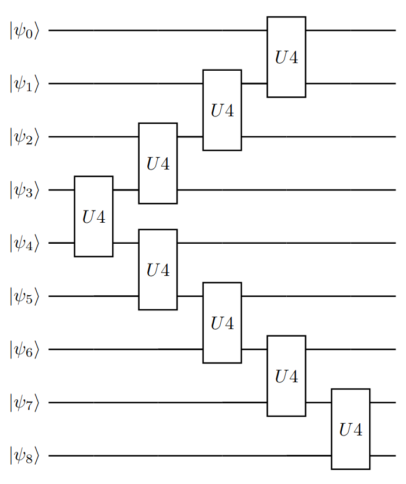

This solution was created during participation in [The Classiq coding competition](https://www.classiq.io/competition). The description of the problem definition uses the materials created for these professions and are available in [Log-Normal state preparation](https://www.classiq.io/competition/state-preparation).

# 1 Introduction
Many quantum algorithms rely on initializing qubits in a specific state. The promised speedup of the algorithm depends on the ability to prepare the quantum state efficiently. The challenge of preparing a quantum state is an example of a broader use case of compiling isometrics into specific quantum circuit and it is known that, in general, an exponential number of gates, O(2n), are needed.

One of the popular distributions is the log-normal distribution, used in many places such as in the Black-Scholes model option pricing formula. The log-normal distribution is given by:
```math
\begin{equation}
f(x) = \frac{1}{x \sigma \sqrt{2 \pi}} e^{-\frac{(ln(x) - \mu)^2}{2 \sigma^2}}
\end{equation}
```

# 2 The Problem
Our goal is preparing a log-normal distribution with μ = 0 and σ = 0.1. With fallow conditions:
* Use 9 qubits
* We can choose any mapping between the state vector domain D to the distribution domain (i.e. the discretization) as long as it is continuous.
* The target distribution error should be err < 10−2 , where the metric is the L2 norm.

# 3 The solution
See the file lognormal_state_preparation.jl which contains the full solution code.

## 3.1 The Ansatz
First, we have to choose the Ansatz. I've decided to use Ansatz which looks like a Christmas tree. We start with the qubits in the midle with u4 gate and then we add the u4 gates up and down. 

```julia
# Generate Ansatz
qr = QuantumRegister(N)
cr = ClassicalRegister(N)
qc = QCircuit(qr, cr)
#add_ent_gate(i, j) = qc.cx(i, j)
add_ent_gate(i, j) = qc.u4(i, j)

#qc.x(4)
for i in 0:3
    add_ent_gate(4-i, 4-i-1)
    add_ent_gate(4+i, 4+i+1)
end

# decompose
qc = decompose(qc)
qc.measure(0:N-1, 0:N-1)

# Random parameter
params = getRandParameters(qc)
setparameters!(qc, params)
```



This can be decomposed using U4 - Cartan's KAK decomposition. Any 2 qubits unitary can be decomposed used 3 cx gate (see the paper _"Minimal Universal Two-qubit Quantum Circuits"_ https://arxiv.org/abs/quant-ph/0308033).
```
       ┌─────────────────────────┐                                             »
q2_0: ─┤ U3(5.6798,4.251,3.5437) ├─────────────────────────────────────────────»
       ├─────────────────────────┴┐                                            »
q2_1: ─┤ U3(5.4414,2.3543,1.2375) ├────────────────────────────────────────────»
      ┌┴──────────────────────────┤                                            »
q2_2: ┤ U3(-5.9265,5.1056,6.2208) ├────────────────────────────────────────────»
      ├───────────────────────────┤      ┌────────────┐┌───┐┌────────────┐     »
q2_3: ┤ U3(-4.7315,1.8799,5.5737) ├───■──┤ Ry(6.4337) ├┤ X ├┤ Ry(1.3762) ├──■──»
      └┬──────────────────────────┤ ┌─┴─┐├────────────┤└─┬─┘└────────────┘┌─┴─┐»
q2_4: ─┤ U3(3.2012,1.7538,2.2764) ├─┤ X ├┤ Rz(1.8803) ├──■────────────────┤ X ├»
      ┌┴──────────────────────────┤ └───┘└────────────┘                   └───┘»
q2_5: ┤ U3(2.2872,5.5116,0.57145) ├────────────────────────────────────────────»
      ├───────────────────────────┴┐                                           »
q2_6: ┤ U3(5.6107,-0.24548,1.3413) ├───────────────────────────────────────────»
      └─┬────────────────────────┬─┘                                           »
q2_7: ──┤ U3(4.0377,1.807,4.352) ├─────────────────────────────────────────────»
       ┌┴────────────────────────┤                                             »
q2_8: ─┤ U3(6.553,5.6364,2.2813) ├─────────────────────────────────────────────»
       └─────────────────────────┘                                             »
c2: 9/═════════════════════════════════════════════════════════════════════════»
                                                                               »
«                                                                                 »
«q2_0: ───────────────────────────────────────────────────────────────────────────»
«                                                                                 »
«q2_1: ───────────────────────────────────────────────────────────────────────────»
«                                         ┌──────────────┐┌───┐┌────────────┐     »
«q2_2: ────────────────────────────────■──┤ Ry(-0.65543) ├┤ X ├┤ Ry(6.1005) ├──■──»
«       ┌──────────────────────────┐ ┌─┴─┐└┬────────────┬┘└─┬─┘└────────────┘┌─┴─┐»
«q2_3: ─┤ U3(2.1115,2.6476,5.3022) ├─┤ X ├─┤ Rz(1.9143) ├───■────────────────┤ X ├»
«      ┌┴──────────────────────────┴┐├───┤ ├────────────┤                    ├───┤»
«q2_4: ┤ U3(3.6171,-0.88801,1.6704) ├┤ X ├─┤ Rz(3.8027) ├───■────────────────┤ X ├»
«      └────────────────────────────┘└─┬─┘┌┴────────────┤ ┌─┴─┐┌────────────┐└─┬─┘»
«q2_5: ────────────────────────────────■──┤ Ry(0.47131) ├─┤ X ├┤ Ry(4.9733) ├──■──»
«                                         └─────────────┘ └───┘└────────────┘     »
«q2_6: ───────────────────────────────────────────────────────────────────────────»
«                                                                                 »
«q2_7: ───────────────────────────────────────────────────────────────────────────»
«                                                                                 »
«q2_8: ───────────────────────────────────────────────────────────────────────────»
«                                                                                 »
«c2: 9/═══════════════════════════════════════════════════════════════════════════»
«                                                                                 »
«                                                                                 »
«q2_0: ───────────────────────────────────────────────────────────────────────────»
«                                           ┌────────────┐┌───┐┌────────────┐     »
«q2_1: ──────────────────────────────────■──┤ Ry(3.8038) ├┤ X ├┤ Ry(4.9307) ├──■──»
«        ┌──────────────────────────┐  ┌─┴─┐├────────────┤└─┬─┘└────────────┘┌─┴─┐»
«q2_2: ──┤ U3(0.65344,3.9727,6.886) ├──┤ X ├┤ Rz(3.0912) ├──■────────────────┤ X ├»
«       ┌┴──────────────────────────┤  └───┘└────┬─┬─────┘                   └───┘»
«q2_3: ─┤ U3(0.99679,5.5945,3.7461) ├────────────┤M├──────────────────────────────»
«      ┌┴───────────────────────────┴─┐          └╥┘       ┌─┐                    »
«q2_4: ┤ U3(-0.29953,-0.25002,4.8387) ├───────────╫────────┤M├────────────────────»
«      └──┬────────────────────────┬──┘┌───┐      ║        └╥┘ ┌────────────┐     »
«q2_5: ───┤ U3(2.547,3.55,0.60107) ├───┤ X ├──────╫─────────╫──┤ Rz(4.0322) ├──■──»
«         └────────────────────────┘   └─┬─┘      ║         ║  ├────────────┤┌─┴─┐»
«q2_6: ──────────────────────────────────■────────╫─────────╫──┤ Ry(4.7104) ├┤ X ├»
«                                                 ║         ║  └────────────┘└───┘»
«q2_7: ───────────────────────────────────────────╫─────────╫─────────────────────»
«                                                 ║         ║                     »
«q2_8: ───────────────────────────────────────────╫─────────╫─────────────────────»
«                                                 ║         ║                     »
«c2: 9/═══════════════════════════════════════════╩═════════╩═════════════════════»
«                                                 3         4                     »
«                                                     ┌────────────┐        ┌───┐┌────────────┐     »
«q2_0: ───────────────────────────────────■───────────┤ Ry(4.6314) ├────────┤ X ├┤ Ry(1.5822) ├──■──»
«        ┌───────────────────────────┐  ┌─┴─┐         ├───────────┬┘        └─┬─┘└────────────┘┌─┴─┐»
«q2_1: ──┤ U3(0.55398,6.3521,5.7348) ├──┤ X ├─────────┤ Rz(3.516) ├───────────■────────────────┤ X ├»
«      ┌─┴───────────────────────────┴─┐└───┘         └───────────┘                   ┌─┐      └───┘»
«q2_2: ┤ U3(3.8211,-1.4551,-0.0096801) ├──────────────────────────────────────────────┤M├───────────»
«      └───────────────────────────────┘                                              └╥┘           »
«q2_3: ────────────────────────────────────────────────────────────────────────────────╫────────────»
«                                                                                      ║            »
«q2_4: ────────────────────────────────────────────────────────────────────────────────╫────────────»
«                                       ┌───┐┌─────────────────────────────┐           ║        ┌─┐ »
«q2_5: ─────────────────────────────────┤ X ├┤ U3(0.56302,-2.0711,0.99718) ├───────────╫────────┤M├─»
«               ┌─────────────┐         └─┬─┘└┬───────────────────────────┬┘┌───┐      ║        └╥┘ »
«q2_6: ─────────┤ Ry(-1.4537) ├───────────■───┤ U3(5.6811,0.33145,8.0742) ├─┤ X ├──────╫─────────╫──»
«               └─────────────┘               └───────────────────────────┘ └─┬─┘      ║         ║  »
«q2_7: ───────────────────────────────────────────────────────────────────────■────────╫─────────╫──»
«                                                                                      ║         ║  »
«q2_8: ────────────────────────────────────────────────────────────────────────────────╫─────────╫──»
«                                                                                      ║         ║  »
«c2: 9/════════════════════════════════════════════════════════════════════════════════╩═════════╩══»
«                                                                                      2         5  »
«      ┌──────────────────────────┐                                                             ┌─┐»
«q2_0: ┤ U3(4.9844,5.8679,3.6173) ├─────────────────────────────────────────────────────────────┤M├»
«      ├─────────────────────────┬┘                                                             └╥┘»
«q2_1: ┤ U3(3.2717,4.6411,5.061) ├───────────────────────────────────────────────────────────────╫─»
«      └─────────────────────────┘                                                               ║ »
«q2_2: ──────────────────────────────────────────────────────────────────────────────────────────╫─»
«                                                                                                ║ »
«q2_3: ──────────────────────────────────────────────────────────────────────────────────────────╫─»
«                                                                                                ║ »
«q2_4: ──────────────────────────────────────────────────────────────────────────────────────────╫─»
«                                                                                                ║ »
«q2_5: ──────────────────────────────────────────────────────────────────────────────────────────╫─»
«            ┌─────────────┐                          ┌───┐┌──────────────────────────────┐      ║ »
«q2_6: ──────┤ Rz(0.27455) ├─────────■────────────────┤ X ├┤ U3(0.55839,-0.087088,3.5152) ├──────╫─»
«            └┬────────────┤       ┌─┴─┐┌────────────┐└─┬─┘└┬───────────────────────────┬─┘┌───┐ ║ »
«q2_7: ───────┤ Ry(1.4089) ├───────┤ X ├┤ Ry(3.0572) ├──■───┤ U3(0.27895,2.3576,1.5817) ├──┤ X ├─╫─»
«             └────────────┘       └───┘└────────────┘      └───────────────────────────┘  └─┬─┘ ║ »
«q2_8: ──────────────────────────────────────────────────────────────────────────────────────■───╫─»
«                                                                                                ║ »
«c2: 9/══════════════════════════════════════════════════════════════════════════════════════════╩═»
«                                                                                                0 »
«                                                                                      
«q2_0: ────────────────────────────────────────────────────────────────────────────────
«      ┌─┐                                                                             
«q2_1: ┤M├─────────────────────────────────────────────────────────────────────────────
«      └╥┘                                                                             
«q2_2: ─╫──────────────────────────────────────────────────────────────────────────────
«       ║                                                                              
«q2_3: ─╫──────────────────────────────────────────────────────────────────────────────
«       ║                                                                              
«q2_4: ─╫──────────────────────────────────────────────────────────────────────────────
«       ║                                                                              
«q2_5: ─╫──────────────────────────────────────────────────────────────────────────────
«       ║ ┌─┐                                                                          
«q2_6: ─╫─┤M├──────────────────────────────────────────────────────────────────────────
«       ║ └╥┘┌────────────┐                   ┌───┐┌────────────────────────────┐┌─┐   
«q2_7: ─╫──╫─┤ Rz(4.9881) ├──■────────────────┤ X ├┤ U3(1.3831,-1.7975,0.53432) ├┤M├───
«       ║  ║ ├────────────┤┌─┴─┐┌────────────┐└─┬─┘├───────────────────────────┬┘└╥┘┌─┐
«q2_8: ─╫──╫─┤ Ry(2.1057) ├┤ X ├┤ Ry(2.8124) ├──■──┤ U3(1.8948,5.5681,0.26911) ├──╫─┤M├
«       ║  ║ └────────────┘└───┘└────────────┘     └───────────────────────────┘  ║ └╥┘
«c2: 9/═╩══╩══════════════════════════════════════════════════════════════════════╩══╩═
«       1  6                                                                      7  8 
```

## 3.2 Stage 1 - optimization
During the first stage of optimization, we use evenly distributed discretization. There are two reasons for that:
* First, because our problem is fewer parameters we need fewer optimization steps to find a good solution.
* Second, for constant discretization, we need to calculate the desired probability distribution once and use it in every loss function call. Therefore each step of optimization takes less time.

Create the desired probability distribution:
```julia
dx = diss_x[2] - diss_x[1]
ADDN = 2^10
const diss_y_pldf = zeros(2^N, ADDN)
for j in 1:2^N 
    for i in 0:ADDN-1
        x = diss_x[j] + i/ADDN * dx
        diss_y_pldf[j, i+1] = pldf(x)
    end
end
```

Now we can create the loss function.
```julia
function loss_l2_Δ(state)
    err = 0   
    n = length(state) 
    for j in 1:n #(x_val, p_val) in zip(diss_x[1:end-1], state)
        for i in 0:ADDN-1
            err += (diss_y_pldf[j, i+1] - state[j]/dx)^2 * dx/ADDN
        end
    end
    sqrt(err)    
end

function loss_stage1(params)
    start = ket"000000000"
    mat = tomatrix(qc, params)
    state_end = state2probability(mat * start)
    
    return loss_l2_Δ(state_end)
end
```

And finally, we start the optimization.
```julia
val, x, itr = gradientDescent(loss_stage1, loss_stage1', params, α=0.0001, maxItr=500, debug=true,
                              useBigValInc=true, argsArePeriodic=true)
```

## 3.3 Stage 2 - optimization
In stage one we found the parameter which works well in the evenly distributed discretization. But we can change the discretization method as well, so we treat the discretization as a problem parameter in optimization. We encode the parameters in three parts: 
* First is the start value of discretization
* Next, we have the array of difference values between two points in discretization
* And the last part is the Ansatz/model parameters.

To start the optimization we use the parameters and discretization from stage 1.
```julia
params = vcat([start_val], [dx for i in 1:512], best_param)
```

Now we can create the loss function. There is a slight modification to the previously lost function, we have added a penalty function to ensure that the start and end values will not be too small and too big.
```julia
function loss_l2(state, start, Δx)
    err = 0   
    n = length(state) 
    xx = start
    for j in 1:n 
        dx = Δx[j]
        for i in 0:ADDN-1
            x = xx + i/ADDN * dx
            err += (pldf(x) - state[j]/dx)^2 * dx/ADDN
        end
        xx += dx
    end
    err += 1 - cldf(xx)
    err += cldf(start)
    sqrt(err) + max(xx - 1.75, 0) + max(0.57 - start, 0)
end

function loss(params)
    Δx = abs.(params[2:513])
    model_param = params[514:end]
    start = ket"000000000"
    mat = tomatrix(qc, model_param)
    #state_end = qc.measures_matrix * state2probability(mat * start)
    state_end = state2probability(mat * start)
    
    #return 100*loss_mse(state_end, diss_p)
    return loss_l2(state_end, abs(params[1]), Δx)    
end
```

And finally, we start the optimization.

During the optimization, we save in the log the best parameters found till now. Bat sometimes the optimization method cannot find a better point so, in that case, it is good to restart it from the best parameters found lastly.
```julia
val, x, itr = gradientDescent(loss, loss', params, α=0.0000001, maxItr=500, debug=true,
                              useBigValInc=true, argsArePeriodic=true)
```

## 3.4 Export solution
Now we have to export or solution to Python, first we calculate the discretization.

```julia
# Generate the discretization and check the final results
Δx_param = abs.(params[2:513])
opt_x = zeros(513)
opt_x[1] = abs(params[1])
for i in 1:length(Δx_param)
    opt_x[i+1] = opt_x[i] + Δx_param[i]
end

# Print the discretization
println(opt_x)
```

And finaly we generate the Python Qiskit code of the Ansatz circuit with the best parameters.
```julia
println(toPythonQiskitCode(qc))
```

```python
qr1 = QuantumRegister(9)
cr1 = ClassicalRegister(9)
qc = QuantumCircuit(qr1, cr1)
qc.u3(5.679770217925697, 4.251016852930093, 3.5437338099599174, 0)
qc.u3(5.4414444305521865, 2.354307135256903, 1.2375106360535937, 1)
qc.u3(-5.926509974424452, 5.105579985273053, 6.220803793450637, 2)
qc.u3(-4.7314616203642075, 1.8798682031836234, 5.5737349030831105, 3)
qc.u3(3.201179776528541, 1.753779628606808, 2.276393940822889, 4)
qc.cx(3, 4)
qc.ry(6.4337424520833295, 3)
qc.rz(1.8803472065474063, 4)
qc.cx(4, 3)
qc.ry(1.37622694809517, 3)
qc.cx(3, 4)
qc.u3(2.111479170265415, 2.647643433365171, 5.302181247182872, 3)
qc.cx(2, 3)
qc.ry(-0.6554348594430898, 2)
qc.rz(1.9142676280384965, 3)
qc.cx(3, 2)
qc.ry(6.10046184925552, 2)
qc.cx(2, 3)
qc.u3(0.653441307827227, 3.972677408951232, 6.8859818579008865, 2)
qc.cx(1, 2)
qc.ry(3.8038146362032093, 1)
qc.rz(3.0912079807503754, 2)
qc.cx(2, 1)
qc.ry(4.930723984116728, 1)
qc.cx(1, 2)
qc.u3(0.5539812892044788, 6.3521240785694975, 5.734803410944227, 1)
qc.cx(0, 1)
qc.ry(4.631396211030235, 0)
qc.rz(3.5160160070405357, 1)
qc.cx(1, 0)
qc.ry(1.5822384837667445, 0)
qc.cx(0, 1)
qc.u3(4.984363180126585, 5.867871515378414, 3.6173393724017853, 0)
qc.u3(3.2716835155406696, 4.64111910105604, 5.061027693997932, 1)
qc.u3(3.821114354775824, -1.4551420517097016, -0.009680068910482396, 2)
qc.u3(0.996787111078856, 5.594528591259475, 3.7461283499644282, 3)
qc.u3(3.617111888578461, -0.8880106139940267, 1.67043976315479, 4)
qc.u3(2.287238539333411, 5.511579494499221, 0.5714521142705539, 5)
qc.cx(5, 4)
qc.rz(3.802725492932484, 4)
qc.ry(0.47130547011305796, 5)
qc.cx(4, 5)
qc.ry(4.97332952918446, 5)
qc.cx(5, 4)
qc.u3(-0.29953259079769096, -0.25001889490376006, 4.838712232639852, 4)
qc.u3(2.5470329143628603, 3.549985645444483, 0.6010744636307404, 5)
qc.u3(5.610669656210048, -0.24548376869623095, 1.3413055441945323, 6)
qc.cx(6, 5)
qc.rz(4.032151127065874, 5)
qc.ry(4.7104087155607095, 6)
qc.cx(5, 6)
qc.ry(-1.4537100582360183, 6)
qc.cx(6, 5)
qc.u3(0.563020725313747, -2.07108824150549, 0.997181039950089, 5)
qc.u3(5.681055401024746, 0.33144537477752495, 8.074229094966102, 6)
qc.u3(4.037738446851733, 1.806980350762186, 4.351954781482624, 7)
qc.cx(7, 6)
qc.rz(0.2745523724520492, 6)
qc.ry(1.4089227530864126, 7)
qc.cx(6, 7)
qc.ry(3.057200171651369, 7)
qc.cx(7, 6)
qc.u3(0.5583868988591522, -0.08708818785242389, 3.5151991456138365, 6)
qc.u3(0.2789465162342843, 2.3576112389327166, 1.581734903155837, 7)
qc.u3(6.553041368749906, 5.636391301613432, 2.2812658090447404, 8)
qc.cx(8, 7)
qc.rz(4.988148484777791, 7)
qc.ry(2.1057427438462026, 8)
qc.cx(7, 8)
qc.ry(2.8124362586259126, 8)
qc.cx(8, 7)
qc.u3(1.383133441772288, -1.7975187312537604, 0.5343188007447871, 7)
qc.u3(1.894759150030361, 5.568083164220874, 0.2691081343450627, 8)
qc.measure(0, 0)
qc.measure(1, 1)
qc.measure(2, 2)
qc.measure(3, 3)
qc.measure(4, 4)
qc.measure(5, 5)
qc.measure(6, 6)
qc.measure(7, 7)
qc.measure(8, 8)
```
